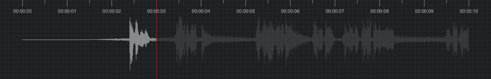

# WFPlayer


> WFPlayer.js is an audio waveform generator



## Demo

[Checkout the demo](https://wfplayer.js.org/) from Github Pages

## Features

-   Create waveforms without loading the entire media file
-   Customize cursor, progress, grid, ruler display and color
-   Support for loading media urls and loading media dom elements (video tags and audio tags)
-   Support for real-time change options like color or width etc
-   Listen to the playback state of media elements for playback animation
-   Adaptive parent element size and audio data
-   And more...

## Install

Install with `npm`

```bash
$ npm install wfplayer
```

Or install with `yarn`

```bash
$ yarn add wfplayer
```

```js
import WFPlayer from 'wfplayer';
```

Or umd builds are also available

```html
<script src="path/to/wfplayer.js"></script>
```

Will expose the global variable to `window.WFPlayer`.

## Usage

HTML

```html
<div id="waveform" style="width: 1000px; height: 300px"></div>
<video id="video" src="path/to/video.mp4"></video>

<!-- or -->
<audio id="audio" src="path/to/audio.mp3"></audio>
```

JS

```js
var wf = new WFPlayer({
    container: document.querySelector('#waveform'),
    mediaElement: document.querySelector('#video'),
});

wf.load(document.querySelector('#video'));

// or
wf.load('path/to/audio.mp3');
```

## API

### Options

```js
var wf = new WFPlayer({
    // Mount the audio waveform of the dom
    container: '#waveform',

    // Whether to use scroll mode
    scrollable: false,

    // Media element like: video tag or audio tag
    mediaElement: null,

    // Whether use web worker
    useWorker: true,

    // Thw refresh delay time
    refreshDelay: 50,

    // Whether to display wave
    wave: true,

    // Waveform color
    waveColor: 'rgba(255, 255, 255, 0.1)',

    // Background color
    backgroundColor: 'rgb(28, 32, 34)',

    // Whether to display cursor
    cursor: true,

    // Cursor color
    cursorColor: '#ff0000',

    // Whether to display progress
    progress: true,

    // progress color
    progressColor: 'rgba(255, 255, 255, 0.5)',

    // Whether to display grid
    grid: true,

    // Grid color
    gridColor: 'rgba(255, 255, 255, 0.05)',

    // Whether to display ruler
    ruler: true,

    // Ruler color
    rulerColor: 'rgba(255, 255, 255, 0.5)',

    // Whether to display scrollbar
    scrollbar: true,

    // Scrollbar color
    scrollbarColor: 'rgba(255, 255, 255, 0.25)',

    // Whether to display ruler at the top
    rulerAtTop: true,

    // Pixel ratio
    pixelRatio: window.devicePixelRatio,

    // Which audio channel to render
    channel: 0,

    // Duration of rendering
    duration: 10,

    // The ratio of spaces on both sides
    padding: 5,

    // Waveform height scale ratio
    waveScale: 0.8,

    // Waveform Size ratio
    waveSize: 1,
});
```

### Instance methods and properties

Load target:

```js
// The target can be the url address of media or a mediaElement or ArrayBuffer or Audiobuffer
wf.load(target);
```

Change Channel:

```js
wf.changeChannel(1);
```

Jump to a certain time:

```js
wf.seek(second);
```

Jump to a certain time with smooth:

```js
wf.smoothSeek(second);
```

Export image:

```js
wf.exportImage();
```

Modify option:

```js
wf.setOptions({
    // Like change wave color
    waveColor: 'red',
});
```

Destroy instance:

```js
wf.destroy();
```

## Common Problem

#### When decoding a video to an audio waveform, it will cause insufficient browser memory.

If the video volume is too large, it will cause the front-end decoding difficult. Best practice is to use the server's `FFMPEG`, convert the video into audio format `MP3`.

`-ac` is the number of channels, `-ar` is a sample rate:

Back End

```bash
ffmpeg -i path/to/video.mp4 -ac 1 -ar 8000 path/to/audio.mp3
```

HTML

```html
<div id="waveform" style="width: 1000px; height: 300px"></div>
<video id="video" src="path/to/video.mp4"></video>
```

JS

```js
var wf = new WFPlayer({
    container: document.querySelector('#waveform'),
    mediaElement: document.querySelector('#video'),
});

wf.load('path/to/audio.mp3');

// or
fetch('path/to/audio.mp3')
    .then((res) => res.arrayBuffer())
    .then((arrayBuffer) => {
        const uint8 = new Uint8Array(arrayBuffer);
        wf.load(uint8);
    });
```

#### If you really don't want to use the server to transfer, I recommend to use `@ffmpeg/ffmpeg`：

```bash
npm i -S @ffmpeg/ffmpeg
```

HTML

```html
<div id="waveform" style="width: 1000px; height: 300px"></div>
<video id="video" src="path/to/video.mp4"></video>
<input type="file" id="file" />
```

JS

```js
import FFmpeg from '@ffmpeg/ffmpeg';

const wf = new WFPlayer({
    container: document.querySelector('#waveform'),
    mediaElement: document.querySelector('#video'),
});

document.getElementById('file').addEventListener('change', async (event) => {
    const file = event.target.files[0];
    const { createFFmpeg, fetchFile } = FFmpeg;
    const ffmpeg = createFFmpeg({ log: true });
    await ffmpeg.load();
    ffmpeg.FS('writeFile', file.name, await fetchFile(file));
    await ffmpeg.run('-i', file.name, '-ac', '1', '-ar', '8000', 'audio.mp3');
    const uint8 = ffmpeg.FS('readFile', 'audio.mp3');

    await wf.load(uint8);
})
```

#### How to add a custom event

```js
var wf = new WFPlayer({
    container: document.querySelector('#waveform'),
    mediaElement: document.querySelector('#video'),
});

wf.load('path/to/audio.mp3');

// click event
wf.on('click', (currentTime) => {
     wf.seek(currentTime)
});

// grab event
wf.on('grabbing', (currentTime) => {
    wf.seek(currentTime)
});

// scroll event
wf.on('scroll', (deltaY) => {
    wf.seek(wf.currentTime + deltaY / 10)
});
```

#### How to get currentTime from an event

```js
var waveform = document.querySelector('#waveform')
var wf = new WFPlayer({
    container: waveform,
    mediaElement: document.querySelector('#video'),
});

wf.load('path/to/audio.mp3');

waveform.addEventListener('mousemove', event => {
    const currentTime = this.getCurrentTimeFromEvent(event);
    console.log(currentTime);
})

waveform.addEventListener('click', event => {
    const currentTime = this.getCurrentTimeFromEvent(event);
    console.log(currentTime);
})
```

## Donations

We accept donations through these channels:

-   [Paypal](https://www.paypal.me/harveyzack)
-   [WeChat Pay](./images/wechatpay.jpg)
-   [Alipay](./images/alipay.jpg)

## QQ Group


## License

MIT © [Harvey Zack](https://sleepy.im/)
